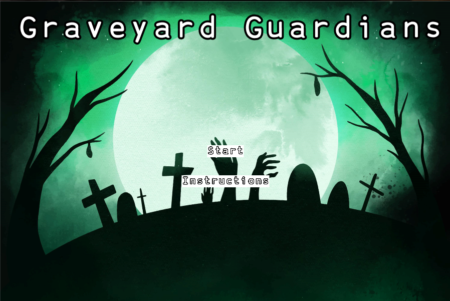
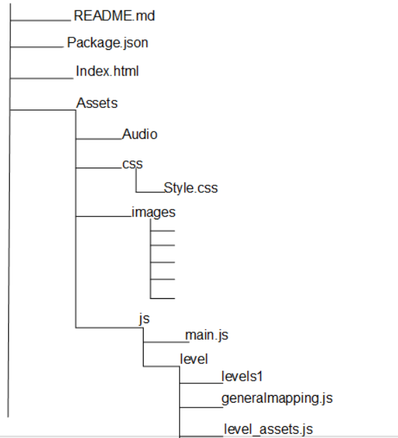
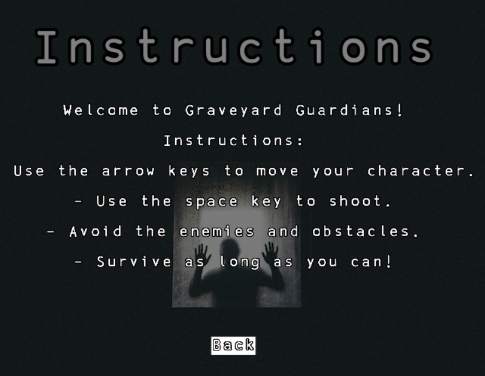
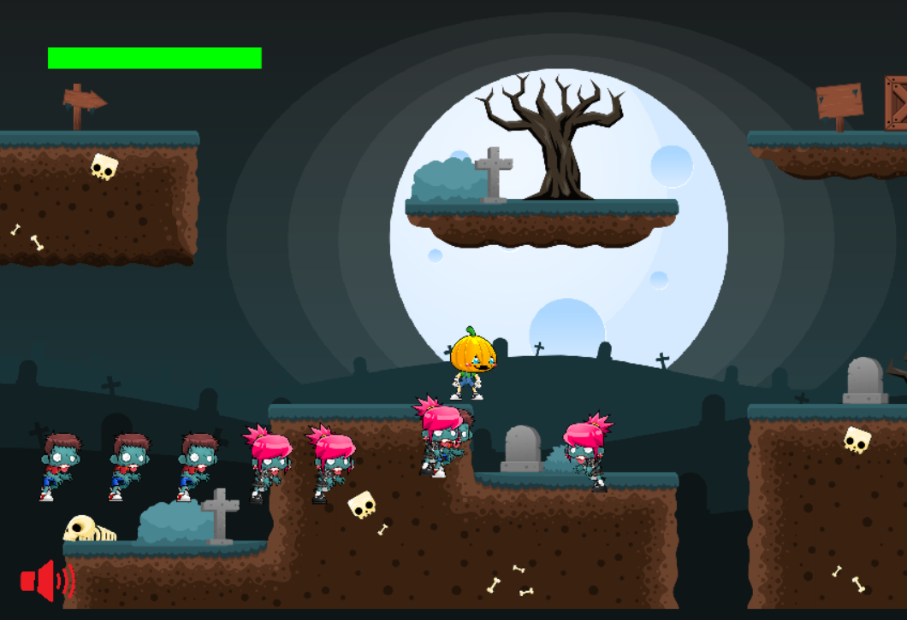
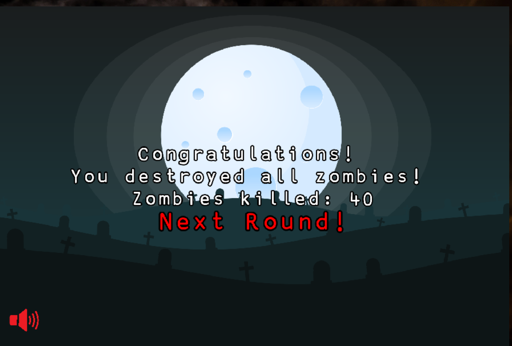

<h1 align="center"><strong>Graveyard Guardians</strong></h1>



## Table of contents
* [Purpose](#purpose)
* [User Experience (UX)](#user-experience-ux)
    * [User Stories](#user-stories)
    * [Structure](#structure)
* [Design](#design)
    * [Typography](#typography)
    * [Wireframes](#wireframes)
    * [Limitations](#limitations)
* [Features](#features)
    * [Existing Features](#existing-features)
* [Technologies](#technologies)
* [Testing](#testing)
    * [Test strategy](#test-strategy)
    * [Test results](#test-results)
* [Deployment](#deployment)
    * [Project creation](#project-creation)
    * [Local Development](#local-development)
        * [Making a clone](#making-a-clone)
        * [Fork Github Repository](#fork-github-repository)
    * [Remote Deployment](#remote-deployment)
    * [Run the app](#run-the-app)
* [Credits](#source--credits)


***

## Purpose
The purpose of the game is to provide players with a fun and entertaining experience. It's a way for players to immerse themselves in the Halloween spirit and enjoy the excitement of action-packed gameplay set in a spooky and supernatural environment.

## wireframes


                 
## User Experience (UX)
-   ### User stories
    As a **(role)** I can **(capability)**, so that **(received benefit)**

    | User story id | As a/an | I want to be able to | So I |
    |---------------|---------|----------------------|----------|
    | 1 | User | See the overall theme of the game from the welcome page | Know what to expect |
    | 2 | User | Easily access the instructions | Learn how to play |
    | 3 | User | Toggle music / sound | Create my own comfort |
    | 4 | User | See game details | Know my score, life / lives |
    | 5 | User | Feel progression in difficulty | Stay focused |

- ### Structure
<br>


## Design

-   ### Typography

-   ### Wireframes
    

-   ### Limitations

## Features
-   ### Existing Features

    
    <br>
    
    <br>
    
    <br>


## Technologies

* HTML
* CSS
* Javascript
* Kaboom.js

## Testing
-   ### Test Strategy

-   ### Test Results

## Deployment
-   ### Project Creation
    The code was committed to [Git](https://git-scm.com) and pushed to [GitHub](https://github.com) using the terminal.

    The project was started by navigating to [GitHub](https://github.com) and creating a new repository by clicking `New` button. Under 'Repository name' input 'graveyard-guardians' and then clicked 'Create repository'.

    Cloned the Github repository by typing the command: 
    ```
    git clone <repo URL>
    ```

    The following commands were used throughout the project:
    * `git add` - This command was used to add files to the staging area before commiting.
    * `git commit` -m *commit message explaining teh updates* - This command was used to commit changes to the local repository.
    * `git push` - This command was used to push all commited changes to the GitHub repository.
    * `git branch` - This command was used to create new branches
    * `git checkout` - This command was used to swap between branches
    * `git pull` - This command was used to get the latest version of the base code
    * `git merge` -This command was used to merge changes itno the main branch

-   ### Local Development
    -   #### Making a clone
        1. Log in to GitHub and locate the [GitHub Repository](https://github.com/JodyMurray/graveyard-guardians)
        2. Click the [Code](assets/images/clone_button.png) button and then choose your method.
        3. To clone the repository using HTTPS, under the "HTTPS" tab copy the link. You could also choose to open it with Github Destop, Visual Studio or download it as a zip file.
        4. Open the command prompt on your computer
        5. Go to the location where you want the clone to be created.
        6. Type `git clone`, and then paste the URL you copied in Step 3.

        ```
        $ git clone https://github.com/JodyMurray/graveyard-guardians.git
        ```

        7. Pressing `Enter` will create the clone.
    -   #### Fork Github Repository
        Forking means making a copy of the original repository on your own GitHub account.
        This gives you your own version to make changes without affecting the original repository.

        1. Log in to GitHub and locate [GitHub Repository](https://github.com/JodyMurray/graveyard-guardians)
        2. Locate the `Fork` button at the top right of the GitHub page
        3. Click this to see the `Create a new fork` page. Click `Create fork` and you should now have a copy of the original repository in your GitHub account


-   ### Remote Deployment

-   ### Run the app
    To run this app on your local machine, after the repository was cloned, open a Live server starting with index.html page

## Credits

We took help for this project from following:
* Pixabay for sounds - [pixxabay](https://pixabay.com/sound-effects/)
* Background music - [itch.io](https://davidkbd.itch.io/spooky-playtime-spooky-and-crazy-music-pack)
* Flaticon for Background image - [flaticon](https://www.flaticon.com/search?word=halloween%20background)
* Freepik for images - [freepick](https://www.freepik.com/search?format=search&query=halloween)
* Remove.bg for Remove background image - [remove.bg](https://www.remove.bg/upload)
* Jack-o-Lantern sprites - [gameart2d.com](https://www.gameart2d.com/jack-o-lantern-free-sprites.html)
* Zombies sprites - [gameart2d.com](https://opengameart.org/content/free-graveyard-platformer-tileset)
* graveyard tile set - [opengameart.org](https://opengameart.org/content/free-graveyard-platformer-tileset)